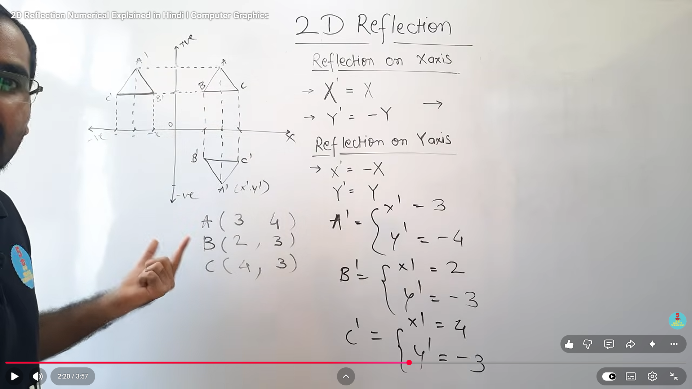

# Reflection in 2D (Computer Graphics)

## Definition
Reflection is a transformation that creates a mirror image of an object about a given line, such as the X-axis or Y-axis.

In reflection, the shape and size remain the same, but the position changes.

---

## Reflection Rules

### 1. Reflection on X-axis
If a point is reflected about the X-axis, then:

$$
x' = x
$$

$$
y' = -y
$$

So the X coordinate stays the same and the Y coordinate changes sign.

### 2. Reflection on Y-axis
If a point is reflected about the Y-axis, then:

$$
x' = -x
$$

$$
y' = y
$$

So the Y coordinate stays the same and the X coordinate changes sign.

---

## Steps to Solve a Reflection Problem

1. Identify the axis of reflection, such as the X-axis or Y-axis.
2. Write the coordinates of each vertex of the object.
3. Apply the reflection rule:
	- For X-axis reflection, keep `x` same and change the sign of `y`.
	- For Y-axis reflection, keep `y` same and change the sign of `x`.
4. Find the new coordinates of all points.
5. Plot the reflected points and join them in the same order to get the mirror image.

---

## Example According to the Image

Given triangle vertices:

$$
A(3,4), \quad B(2,3), \quad C(4,3)
$$

The image shows reflection about the X-axis.

### Apply the X-axis reflection rule

For point `A(3,4)`:

$$
x' = 3
$$

$$
y' = -4
$$

So,

$$
A'(3,-4)
$$

For point `B(2,3)`:

$$
x' = 2
$$

$$
y' = -3
$$

So,

$$
B'(2,-3)
$$

For point `C(4,3)`:

$$
x' = 4
$$

$$
y' = -3
$$

So,

$$
C'(4,-3)
$$

### Final reflected triangle

The reflected triangle after X-axis reflection is:

$$
A'(3,-4), \quad B'(2,-3), \quad C'(4,-3)
$$

---

## Short Trick to Remember

- X-axis reflection: `x` stays same, `y` becomes negative.
- Y-axis reflection: `y` stays same, `x` becomes negative.

---

## Matrix Form

### Reflection about X-axis

$$
\begin{bmatrix}
 x' \\
 y' \\
 1
\end{bmatrix}
=
\begin{bmatrix}
 1 & 0 & 0 \\
 0 & -1 & 0 \\
 0 & 0 & 1
\end{bmatrix}
\begin{bmatrix}
 x \\
 y \\
 1
\end{bmatrix}
$$

### Reflection about Y-axis

$$
\begin{bmatrix}
 x' \\
 y' \\
 1
\end{bmatrix}
=
\begin{bmatrix}
 -1 & 0 & 0 \\
 0 & 1 & 0 \\
 0 & 0 & 1
\end{bmatrix}
\begin{bmatrix}
 x \\
 y \\
 1
\end{bmatrix}
$$

