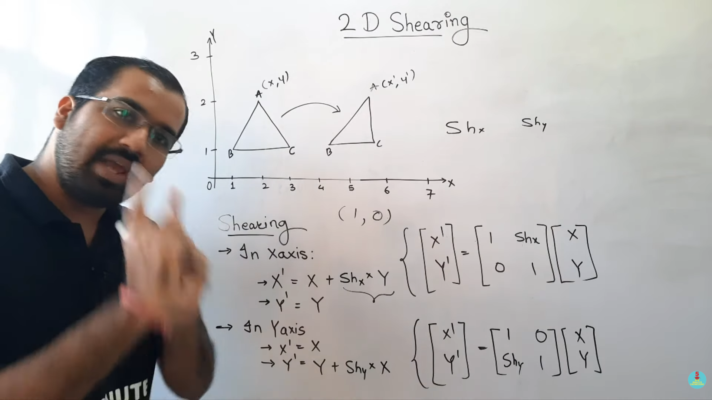
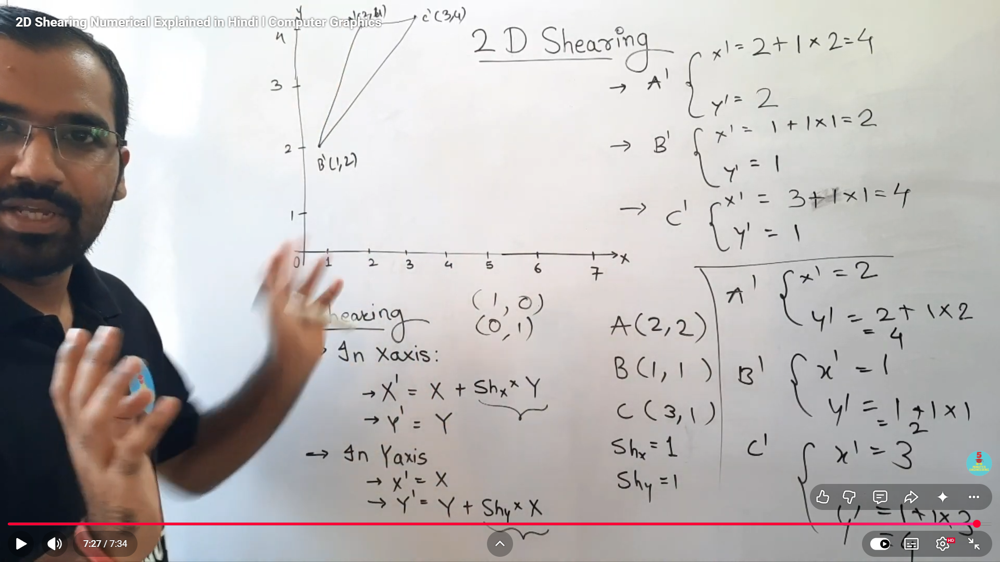

# Shearing in 2D (Computer Graphics)

## Definition
Shearing is a transformation that shifts an object in one direction so that its shape appears slanted.

In shearing, the object changes its shape, but the area and orientation rules depend on the type of shear applied.

---

## Types of Shearing

### 1. X-axis Shearing
In X-axis shearing, the object is shifted along the X direction based on its Y coordinate.

$$
x' = x + Sh_x \cdot y
$$

$$
y' = y
$$

### 2. Y-axis Shearing
In Y-axis shearing, the object is shifted along the Y direction based on its X coordinate.

$$
x' = x
$$

$$
y' = y + Sh_y \cdot x
$$

---

## Shearing Matrix Form

### X-axis Shearing

$$
\begin{bmatrix}
x' \\
y' \\
1
\end{bmatrix}
=
\begin{bmatrix}
1 & Sh_x & 0 \\
0 & 1 & 0 \\
0 & 0 & 1
\end{bmatrix}
\begin{bmatrix}
x \\
y \\
1
\end{bmatrix}
$$

### Y-axis Shearing

$$
\begin{bmatrix}
x' \\
y' \\
1
\end{bmatrix}
=
\begin{bmatrix}
1 & 0 & 0 \\
Sh_y & 1 & 0 \\
0 & 0 & 1
\end{bmatrix}
\begin{bmatrix}
x \\
y \\
1
\end{bmatrix}
$$

---

## Steps to Solve a Shearing Problem

1. Identify whether the problem is X-axis shearing or Y-axis shearing.
2. Write the coordinates of all vertices.
3. Note the shear factor, such as `Shx` or `Shy`.
4. Apply the correct formula to each point.
5. Find the new coordinates and plot the transformed object.

---

## Example According to the Image

The image shows X-axis shearing with:

$$
Sh_x = 1
$$

Given triangle vertices:

$$
A(2,2), \quad B(1,1), \quad C(3,1)
$$

For X-axis shearing:

$$
x' = x + Sh_x \cdot y
$$

$$
y' = y
$$

### Find the new coordinates

For point `A(2,2)`:

$$
x' = 2 + 1 \times 2 = 4
$$

$$
y' = 2
$$

So,

$$
A'(4,2)
$$

For point `B(1,1)`:

$$
x' = 1 + 1 \times 1 = 2
$$

$$
y' = 1
$$

So,

$$
B'(2,1)
$$

For point `C(3,1)`:

$$
x' = 3 + 1 \times 1 = 4
$$

$$
y' = 1
$$

So,

$$
C'(4,1)
$$

### Final sheared triangle

The new triangle after X-axis shearing is:

$$
A'(4,2), \quad B'(2,1), \quad C'(4,1)
$$

---

## Short Trick to Remember

- X-axis shearing: `x` changes, `y` stays the same.
- Y-axis shearing: `y` changes, `x` stays the same.

---

## Key Points

- Shearing slants the object.
- The amount of slant depends on the shear factor.
- Different vertices may move by different amounts because the shift depends on the other coordinate.
- The object looks tilted after transformation.

