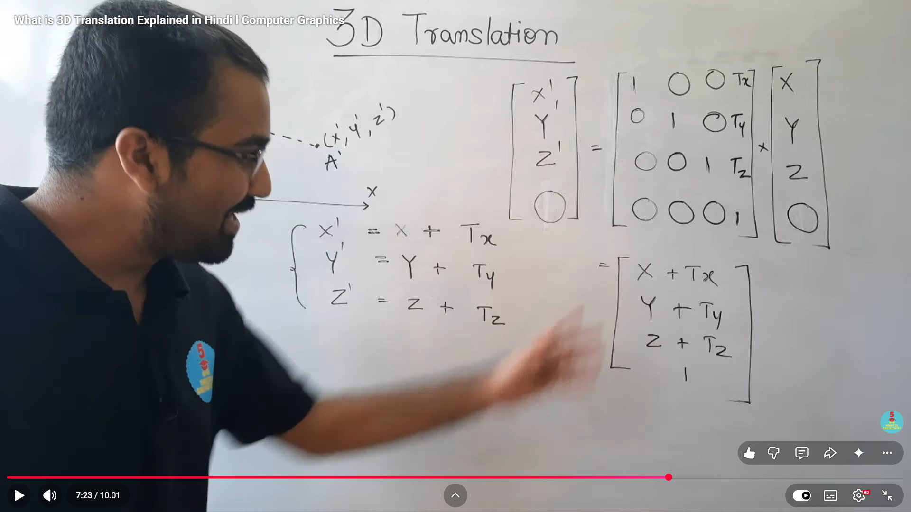
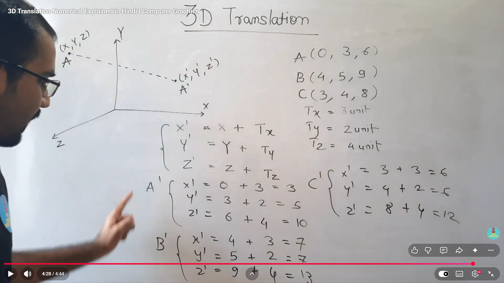

# Translation in 3D (Computer Graphics)

## Definition
3D Translation means moving an object in three-dimensional space from one position to another without changing its shape, size, or orientation.

If a point is:
- `P(x, y, z)`

and translation values are:
- `Tx` along X-axis
- `Ty` along Y-axis
- `Tz` along Z-axis

then the new point is:
- `P'(x', y', z') = (x + Tx, y + Ty, z + Tz)`

---

## 3D Translation Equations

$$
x' = x + T_x
$$

$$
y' = y + T_y
$$

$$
z' = z + T_z
$$

For every vertex of a 3D object, apply the same equations.

---

## Matrix Form (Homogeneous Coordinates)

A 3D point in homogeneous form:

$$
\begin{bmatrix}
x \\
y \\
z \\
1
\end{bmatrix}
$$

Translation matrix for 3D:

$$
T =
\begin{bmatrix}
1 & 0 & 0 & T_x \\
0 & 1 & 0 & T_y \\
0 & 0 & 1 & T_z \\
0 & 0 & 0 & 1
\end{bmatrix}
$$

After translation:

$$
\begin{bmatrix}
x' \\
y' \\
z' \\
1
\end{bmatrix}
=
\begin{bmatrix}
1 & 0 & 0 & T_x \\
0 & 1 & 0 & T_y \\
0 & 0 & 1 & T_z \\
0 & 0 & 0 & 1
\end{bmatrix}
\begin{bmatrix}
x \\
y \\
z \\
1
\end{bmatrix}
$$

---

## Steps to Solve a 3D Translation Problem

1. Identify the coordinates of each point of the object in 3D space.
2. Note the translation values: `Tx`, `Ty`, and `Tz`.
3. Apply the translation equations to each point.
4. Find the new coordinates `(x', y', z')` for all points.
5. The translated object maintains the same shape and size.

---

## Example According to the Image

Given three points in 3D space:

$$
A(0, 3, 6), \quad B(4, 5, 9), \quad C(3, 4, 8)
$$

Translation vector:

$$
T_x = 3 \text{ units}, \quad T_y = 2 \text{ units}, \quad T_z = 4 \text{ units}
$$

Using the translation equations:

$$
x' = x + T_x, \quad y' = y + T_y, \quad z' = z + T_z
$$

### Find the translated coordinates

For point `A(0, 3, 6)`:

$$
x' = 0 + 3 = 3
$$

$$
y' = 3 + 2 = 5
$$

$$
z' = 6 + 4 = 10
$$

So,

$$
A'(3, 5, 10)
$$

For point `B(4, 5, 9)`:

$$
x' = 4 + 3 = 7
$$

$$
y' = 5 + 2 = 7
$$

$$
z' = 9 + 4 = 13
$$

So,

$$
B'(7, 7, 13)
$$

For point `C(3, 4, 8)`:

$$
x' = 3 + 3 = 6
$$

$$
y' = 4 + 2 = 6
$$

$$
z' = 8 + 4 = 12
$$

So,

$$
C'(6, 6, 12)
$$

### Final translated points

The translated 3D points are:

$$
A'(3, 5, 10), \quad B'(7, 7, 13), \quad C'(6, 6, 12)
$$

---

## Key Points

- 3D translation only changes position.
- Lines remain parallel after translation.
- Shape, size, and orientation remain unchanged.
- The same translation vector is applied to all vertices.
- All three coordinates (x, y, z) are affected by their respective translation values.

---

## Pseudocode

```text
for each vertex (x, y, z) in object:
	x' = x + Tx
	y' = y + Ty
	z' = z + Tz
```

---

## Difference: 2D vs 3D Translation

| Property | 2D Translation | 3D Translation |
|----------|---|---|
| Coordinates | (x, y) | (x, y, z) |
| Translation factors | Tx, Ty | Tx, Ty, Tz |
| Equations | x' = x + Tx, y' = y + Ty | x' = x + Tx, y' = y + Ty, z' = z + Tz |
| Matrix size | 3×3 | 4×4 |
