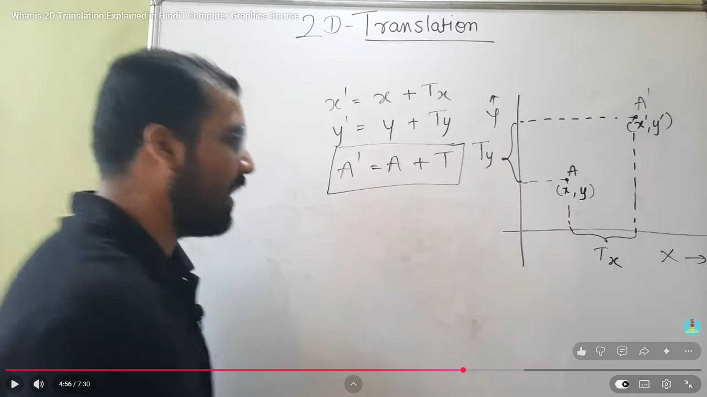
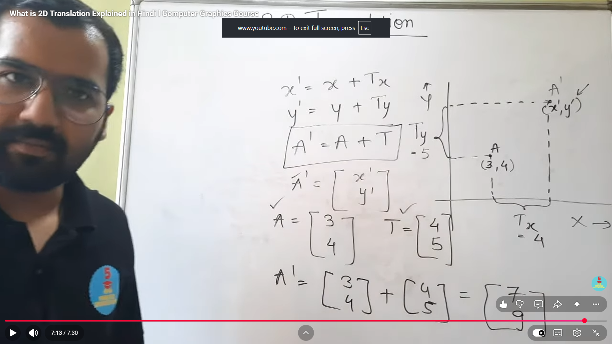

# Translation in 2D (Computer Graphics)

## Definition
**Translation** means moving an object from one position to another without changing its shape, size, or orientation.

If a point is:
- `P(x, y)`

and translation values are:
- `tx` along X-axis
- `ty` along Y-axis

then new point is:
- `P'(x', y') = (x + tx, y + ty)`

---

## Translation Equations
$$
x' = x + t_x
$$
$$
y' = y + t_y
$$

For every vertex of a 2D object, apply the same equations.

---

## Matrix Form (Homogeneous Coordinates)

A 2D point in homogeneous form:

$$
\begin{bmatrix}
x \\
y \\
1
\end{bmatrix}
$$

Translation matrix:
$$
T =
\begin{bmatrix}
1 & 0 & t_x \\
0 & 1 & t_y \\
0 & 0 & 1
\end{bmatrix}
$$

After translation:
$$
\begin{bmatrix}
x' \\
y' \\
1
\end{bmatrix}
=
\begin{bmatrix}
1 & 0 & t_x \\
0 & 1 & t_y \\
0 & 0 & 1
\end{bmatrix}
\begin{bmatrix}
x \\
y \\
1
\end{bmatrix}
$$
---

## Example

Given point `A(2, 3)` and translation vector `(tx, ty) = (4, -1)`:

- `x' = 2 + 4 = 6`
- `y' = 3 + (-1) = 2`

So, translated point is **A'(6, 2)**.

---

## Key Points
- Translation only changes position.
- Lines remain parallel after translation.
- Shape and size remain unchanged.
- Same translation vector is applied to all vertices.

---

## Pseudocode

```text
for each vertex (x, y) in object:
	x = x + tx
	y = y + ty
```



Using the same example from the board:

Given point  
$$A=(x,y)=(3,4)$$

Translation vector  
$$T=(T_x,T_y)=(4,5)$$

Formula for 2D translation:
$$x' = x + T_x,\quad y' = y + T_y$$

Substitute values:
$$x' = 3 + 4 = 7$$
$$y' = 4 + 5 = 9$$

So the translated point is:
$$A'=(x',y')=(7,9)$$

Vector form:
$$A' = A + T = \begin{bmatrix}3\\4\end{bmatrix} + \begin{bmatrix}4\\5\end{bmatrix} = \begin{bmatrix}7\\9\end{bmatrix}$$

Meaning: the point moves 4 units right and 5 units up.

